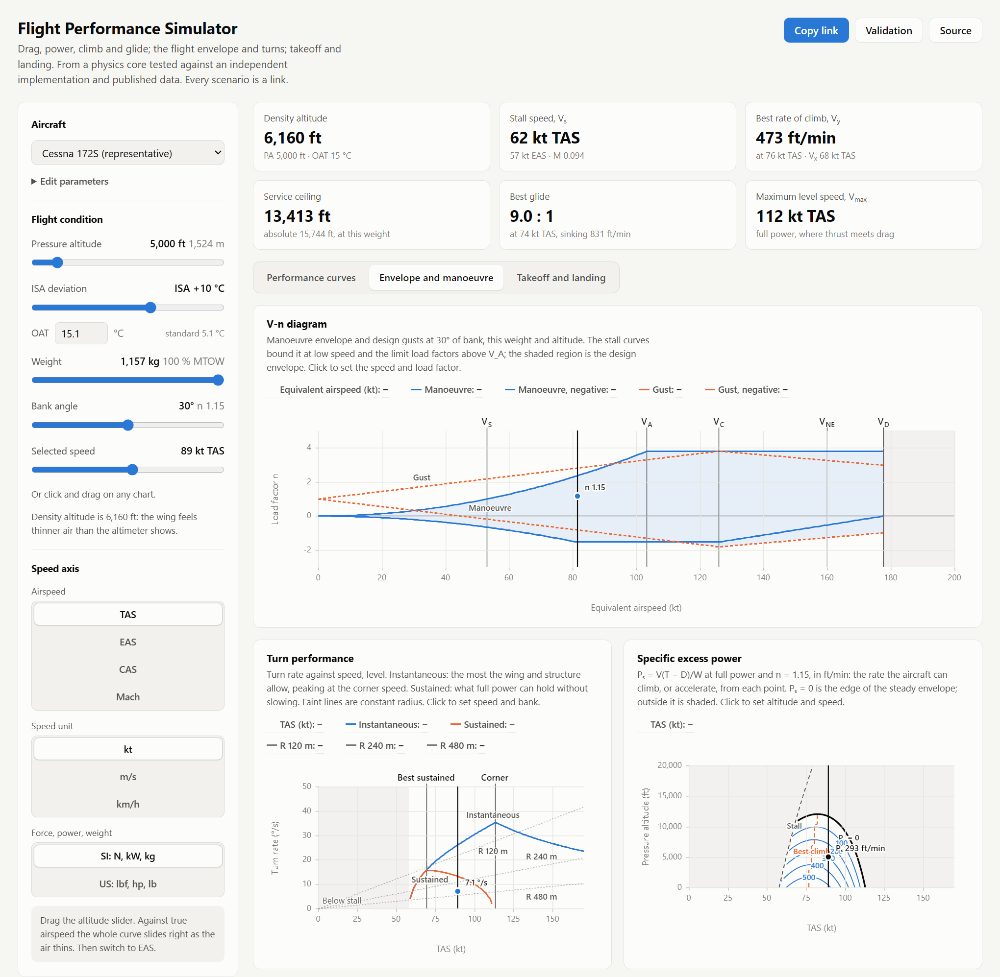

# Flight Performance Simulator

[](https://github.com/satwiksharma01/flight-performance-sim/actions/workflows/ci.yml)

Aircraft performance analysis in the browser: drag, power, climb, ceilings and glide;
the V-n diagram, turns and specific excess power; takeoff and landing. Everything
responds instantly as you drag a slider. The physics core is dependency-free
TypeScript, cross-checked against an independent Python implementation, against
published standards and textbook examples, and, for the Cessna 172S, against its POH,
table by table.

<picture>
  <source media="(prefers-color-scheme: dark)" srcset="docs/explorer-dark.png">
  
</picture>

**Live:** [satwiksharma01.github.io/flight-performance-sim](https://satwiksharma01.github.io/flight-performance-sim/) · [validation](https://satwiksharma01.github.io/flight-performance-sim/validation.html)

**Status:** v0.5, envelope and manoeuvre. Three tabs: performance curves, the
envelope (V-n diagram, turn performance, P_s contours), and takeoff and landing. A
[/validation](validation.html) page shows the model against every published figure
and every cell of the 172S's POH tables, and CI re-runs the tests and the independent
cross-check on every push, and deploys to GitHub Pages when they pass. See [ROADMAP.md](ROADMAP.md).

## What it shows

- **Drag** (total, parasite, induced), **power required** and **L/D** against speed,
  with `V_s`, `V_mp`, `V_md` and `V_jr` marked. Click or drag on any chart to read
  off a point.
- **The speed axis in TAS, EAS, CAS or Mach**, in knots, m/s or km/h. CAS is
  compressible, with the Rayleigh pitot formula above Mach 1.
- **The condition the way performance data states it:** pressure altitude (flight
  levels from FL180), and ISA deviation or OAT. Density altitude is the headline
  number, and the true altitude of the pressure level is integrated through the
  column.
- **Weight and bank angle.** Operating weight from 40 % of max takeoff mass, and a
  bank angle that sets the load factor. Turn radius and rate at the selected speed,
  and W/δ.
- **Three presets** (Cessna 172S at its 2,550 lb gross weight, a jet trainer, a
  sailplane), and an editor for max takeoff mass, wing area, aspect ratio, Oswald
  efficiency, CD₀, CLmax and flap CLmax. The landing-flap stall speed `V_s0` is
  listed with the others.
- **Climb at full power:**
  - Thrust and power available on the drag and power charts, meeting the curves at
    maximum level speed.
  - A rate-of-climb chart: the exact steady climb against the small-angle
    (P_A − P_R)/W, with `V_x` and `V_y`.
  - Best rate of climb against altitude, down to the service and absolute ceilings.
  - Piston (optionally turbocharged), turboprop and turbofan engine models, all
    editable.
- **Glide, power off:** best glide ratio and speed, minimum sink, and distance from
  the current altitude. For a glider the rate-of-climb chart becomes the glider polar.
- **The V-n diagram,** in EAS: stall curves, limit load factors (negative limit at
  V_D by certification category), the former 14 CFR 23.341
  gust lines with the Pratt alleviation factor, and the design envelope, with
  `V_S`, `V_A`, `V_C`, `V_NE` and `V_D`. The current speed and bank are a point on it,
  inside or outside.
- **Turn performance:** instantaneous and sustained turn rate against speed (the
  "doghouse"), the corner speed, and lines of constant radius.
- **Specific excess power,** `P_s = V(T − D)/W`, contoured over altitude and speed:
  `P_s = 0` is the edge of the steady envelope, with the stall line, the best-climb
  schedule and, for the jet, energy-height lines.
- **Takeoff and landing over 50 ft:** ground roll and total against pressure altitude
  on the current ISA day, each split into its phases, on seven runway surfaces with a
  head- or tailwind. For the stock 172S the POH's own tables are drawn over the
  curves.
- **Range and endurance** by the Breguet equations, in all four cases: a propeller
  flies best range at `V_md` and best endurance at `V_mp`, a jet at `V_jr` and
  `V_md`. A **payload–range diagram** shows the trade from full payload to ferry
  range. Fuel capacity, empty mass and SFC are editable.
- **SI or US units** for force, power, weight and area: N, kW and kg, or lbf, hp
  and lb.
- **Every scenario is a link.** `?ac=c172&h=2438.4&disa=15` is a Cessna at
  8,000 ft on an ISA +15 day. An edited preset stays short: `?ac=c172&cd0=0.03`.

<picture>
  <source media="(prefers-color-scheme: dark)" srcset="docs/envelope-dark.png">
  
</picture>

### Things to try

1. **Drag the altitude slider against TAS.** The whole curve slides right as the air
   thins. Switch the axis to EAS and it stops moving: drag depends only on dynamic
   pressure, and EAS fixes it.
2. **Stay on EAS and watch the power chart.** It still rises with altitude, because
   power is drag times *true* airspeed.
3. **Pick the jet trainer.** `V_jr`, the jet's best-range speed, sits 32 % above
   best L/D. A propeller aircraft gets its best range at best L/D itself.
4. **Raise CD₀ in the editor.** `(L/D)max` falls and `V_md` gets slower, as
   `V_md ∝ (k/CD₀)^¼` says it should.
5. **Bank to 60°.** Every speed on the chart moves up by √2, and the minimum drag
   doubles: the wing now carries twice the weight. Lighten the aircraft and watch
   the curves move the other way, by √W.
6. **Climb the 172S.** Drag the altitude up and watch power available sink onto
   power required. The gap between them is the rate of climb, and it closes at the
   absolute ceiling, where V_x and V_y meet.
7. **Turbocharge it.** In the editor, give the engine a critical altitude of
   12,000 ft: the service ceiling jumps from 14,000 ft to about 24,000.
8. **Find the corner.** On the envelope tab, click the turn chart at its peak: that is
   the corner speed, where the 172 turns fastest, at its 3.8 g limit. Slower, the
   wing stalls first; faster, the structure would break first. The same point sits
   on the V-n diagram's corner, at `V_A`.
9. **Go hot and high.** On the takeoff tab, set 5,000 ft and ISA +25. The 172's
   takeoff over 50 ft grows by two-thirds, and the POH's dots move with the curves.
10. **Fly the jet up its P_s map.** The dashed best-climb line leans to higher speeds
    as it climbs, and the faint energy-height lines show why a jet trades speed for
    height on the way up.

## Validation

The **Validation** page (`validation.html`) lists 43 published figures from four
sources: the US Standard Atmosphere 1976 tables, NACA Report 1135, Anderson's worked
examples, and the Cessna 172S POH. Each shows published value, model value,
difference, tolerance and status, computed live in the browser. Below them are the
172S POH's climb, takeoff and landing tables, all 207 cells, each coloured by the
model's error.

Every figure has a role, because "matches published data" means different things:

| Role | Meaning |
|---|---|
| Reference | A standard or textbook value the physics must reproduce |
| Calibration | A figure a parameter was fitted to. Reproducing it proves the fit, not the model |
| Check | A figure the fit never saw. These are the real test |
| Known discrepancy | A miss pinned to a band, with its cause, not tuned away |

The figures live in one dataset, `src/data/validation/cases.ts`. The page renders it
and `tests/published.test.ts` asserts it, so the two can't disagree. The page also
shows the last run of the independent Python implementation, and CI runs both on
every push.

What the 172S comparison says, in brief:

- **Range and endurance:** Anderson's CP-1 example (*Introduction to Flight*, 8th ed.,
  Example 6.19), 1,207 mi and 14.4 h, reproduced to within 0.25 %.
- **Limits:** `V_A` at all three published weights within 1.3 kt, never fitted.
- **Climb:** within 5 % at sea level; 10–18 % low at altitude on cold days.
- **Takeoff:** 11–20 % short, a pinned discrepancy. The growth with density altitude
  is right to 8 %, which is what a hot-and-high calculation needs.
- **Landing ground roll:** 21 % short, uniformly: Gudmundsson's braking coefficient
  for dry pavement (0.4) against the 0.29 the POH implies.

## Running it

```bash
npm install
npm run dev          # the explorer at http://localhost:5173, validation at /validation.html
npm test             # 355 tests
npm run validate     # cross-check against the independent Python reference (needs SciPy)
npm run typecheck
npm run build        # static site in dist/, relative paths, any host
```

## What is implemented

| Module | Contents |
|---|---|
| `src/physics/constants.ts` | ISA constants and the layer table, base pressures derived for continuity |
| `src/physics/units.ts` | Branded unit types and conversions; SI internally, aviation units at the boundary |
| `src/physics/atmosphere.ts` | Layered ISA to 84 852 m, entered by pressure altitude and ΔISA; density and true altitude, Sutherland viscosity |
| `src/physics/airspeed.ts` | TAS / EAS / CAS / Mach; compressible impact pressure, Rayleigh pitot above Mach 1 |
| `src/physics/aero.ts` | Parabolic drag polar, stall speed, and closed-form characteristic speeds |
| `src/physics/performance/curves.ts` | Drag, thrust required, power required and L/D curves, with characteristic-speed markers at any load factor |
| `src/physics/performance/turn.ts` | Level-turn load factor, radius and rate; lift-limited and sustained load factor, corner speed |
| `src/physics/performance/vn.ts` | The V-n diagram: manoeuvre envelope by category, former 14 CFR 23.341 gust lines, design envelope |
| `src/physics/performance/energy.ts` | Specific excess power at any load factor, and energy height |
| `src/physics/performance/range.ts` | Breguet range and endurance, all four cases, and the payload–range diagram |
| `src/physics/performance/field.ts` | Takeoff and landing over 50 ft by Raymer's method, ground runs integrated exactly; runway friction for seven surfaces |
| `src/physics/propulsion.ts` | Piston (Gagg–Farrar with the hot-day correction, turbocharged), turboprop and turbofan lapse; propeller thrust that is finite at zero speed |
| `src/physics/performance/climb.ts` | Exact steady climb and the small-angle form; V_y, V_x, maximum level speed; absolute and service ceilings |
| `src/physics/performance/glide.ts` | Glide from the polar: best glide, minimum sink, best glide in wind, the sink polar |
| `src/data/aircraft/presets.ts` | Id-keyed preset registry — ids are part of the URL format, so treat them as append-only |
| `src/state/url.ts` | Scenario permalinks: delta-encoded, and decoding never throws |
| `src/app/model.ts` | Everything the charts draw, as pure functions: axis conversions, the fixed chart window, sampled curves |
| `src/app/permalink.ts` | View settings in the URL, and delta encoding for edited presets |
| `src/app/envelope.ts`, `runway.ts`, `contour.ts` | The envelope and takeoff tabs' models, and marching-squares contours |
| `src/data/validation/` | The validation dataset, the POH tables, and the cross-check's last run |
| `src/app/components/` | React controls, readouts, and the uPlot chart with its marker overlays |

355 tests, covering the published ISA table at five altitudes, layer continuity,
profile inversion, every closed-form optimum cross-checked against a brute-force
scan, permalink round-trip stability, and the chart model's physics: the drag curve
is identical against EAS at every altitude and slides right by `sqrt(ρ₀/ρ)` against
TAS. Against numbers from outside the code, they reproduce Anderson's CP-1 and CP-2
worked examples and put Mach 0.78 at FL350 at 450 KTAS and 265 KCAS. Property tests
run 2,000 random aircraft and 3,000 hostile links through the explorer.

`validation/reference.py` is an independent implementation in Python, written from
the standards rather than translated from the TypeScript: ISA integrated layer by
layer, CAS by root-solving the pitot relation, and the characteristic speeds by
numerical minimisation. Atmosphere and airspeeds agree to 1e-16, CAS to 1e-8 and the
speeds to 1e-8. It also caught CAS above Mach 1 using the subsonic pitot relation
instead of Rayleigh's, off by up to 6 %; that is fixed, and checked against the
NACA 1135 normal-shock tables.

Two exact identities are pinned as tests because they catch algebra errors that
plausible-looking numbers would hide: every characteristic speed is altitude-invariant
in EAS while varying in TAS, and `V_mp` and `V_jr` share the same L/D and the same
drag, sitting on opposite sides of the polar at `sqrt(3)*CL_md/(4*CD0)`.

## Design notes

**No backend.** Every equation here is closed-form algebra; a network round trip
would only add latency to a tool whose main feature is continuous response to a
slider. Python returns in v0.4 as an independent reference implementation for
cross-validation, which is a better use for it than a CRUD API.

**SI internally, always.** Unit conversion happens once, at the boundary. Branded
types make a feet-for-metres mix-up a compile error rather than a Mars Climate
Orbiter.

**Closed forms over scanning.** `V_md`, `V_mp`, `V_jr` and `(L/D)max` all have exact
analytic solutions. The tests verify them against a 400 000-point scan, so if the
algebra is ever wrong the suite says so. The chart markers come from the same
closed forms, so they never move with sample spacing.

**The axes don't follow the curve.** Each aircraft's chart window is fitted once, at
sea level, and never refits. An auto-scaling axis would rescale along with the curve
and make it look still, hiding the very effect the altitude slider exists to show.

**The URL is the state.** Every change passes through the permalink before it
reaches the screen, so what you see is exactly what a pasted link opens. A malformed
link degrades to defaults and says what it couldn't use.

**Calibrated on some published numbers, checked on others.** Each fitted parameter of
the Cessna 172S comes from exactly two POH figures:
- CLmax: the clean and full-flap stall speeds
- CD₀ and Oswald e: best glide, 68 KIAS at 9:1
- the propeller's thrust line: best rate of climb, 730 ft/min at 74 KIAS

Two figures the fit never saw then test it: V_x comes out at 60.9 kt against the
published 62, and the service ceiling at 13,944 ft against 14,000.

**Known model limits are pinned, not hidden.** The 172S's maximum level speed comes
out at 114.8 KTAS against the published 126, 9 % low. The polar was fitted to a glide
flown with the propeller windmilling, and that drag doesn't exist in powered flight.
A test pins the size of the error rather than retuning it away. The polar has no wave
drag either, so the charts shade everything above Mach 0.7, draw nothing past Mach
0.9, and flag any climb speed or ceiling that depends on that regime as optimistic.

**Hot days, corrected.** Gagg–Farrar was first fed the actual density, so power fell
as 1/T on a hot day: twice the engine makers' 1/√T. The POH's climb table showed it,
with the hot cells off by up to 66 %. Power is now Gagg–Farrar at the standard day's
density for the pressure altitude, times √(T_std/T); the worst hot cell is now within
5 %, and standard days didn't change.

**Field lengths are textbook, and say so.** Takeoff and landing use Raymer's speeds
and segments with the ground runs integrated exactly, and nothing is fitted to the
POH's distances. Where they miss, the miss is pinned with its cause, the same way as
`V_max`.

**No Web Worker.** The roadmap planned one for the P_s map. At 96 × 72 points the grid
builds in about 4 ms and is cached per aircraft, weight and day, so a worker would
add a message protocol and buy nothing.

**A propeller with finite static thrust.** The textbook `T = ηP/V` goes to infinity
at zero speed, and a constant-efficiency propeller puts the 172's V_y down at the
stall with 1,190 ft/min. Thrust here falls in a straight line from its static value,
capped so efficiency never exceeds 1. That is the simplest model that puts V_y where
a fixed-pitch propeller does.

## Physics references

- ISO 2533 / US Standard Atmosphere 1976 — atmospheric model
- Anderson, *Aircraft Performance and Design* — drag polar, characteristic speeds
- Hull, *Fundamentals of Airplane Flight Mechanics* — climb and cruise formulations
- Raymer, *Aircraft Design: A Conceptual Approach*, §17.8–17.9 — takeoff and landing
- Gudmundsson, *General Aviation Aircraft Design* (2014) — runway friction coefficients
- 14 CFR Part 23 before Amendment 23-64 (2017) (§23.333, §23.335, §23.341, §23.1505) — the V-n diagram, gusts and V_NE. The current Part 23 is performance-based and accepts ASTM F3116 for these loads; the classic rules are what today's light aircraft were certificated to

Aircraft parameters in `src/data/aircraft/` are simplified representative figures for
education, not certification data.
