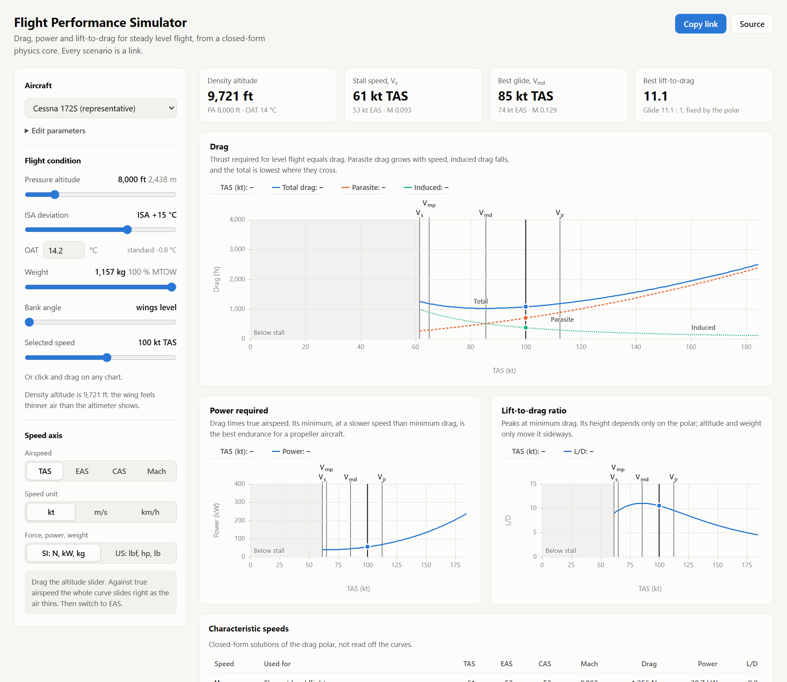

# Flight Performance Simulator

Aircraft performance analysis in the browser. Drag a slider and the drag, power and
lift-to-drag curves respond instantly, with the characteristic speeds marked from
their closed-form solutions. The physics core is dependency-free TypeScript,
validated against published atmospheric tables and — from v0.4 — against an
independent Python implementation and manufacturer performance data.

<picture>
  <source media="(prefers-color-scheme: dark)" srcset="docs/explorer-dark.png">
  
</picture>

**Status:** v0.2. The physics core and the curve explorer are complete and tested;
the site is not deployed yet. See [ROADMAP.md](ROADMAP.md).

## What it shows

- **Drag** (total, parasite, induced), **power required** and **L/D** against speed,
  with `V_s`, `V_mp`, `V_md` and `V_jr` marked. Click or drag on any chart to read
  off a point.
- **The speed axis in TAS, EAS, CAS or Mach**, in knots, m/s or km/h.
- **Altitude and ISA temperature deviation**, with density altitude as a headline
  number.
- **Three presets** (Cessna 172S, a jet trainer, a sailplane) and an editor for
  mass, wing area, aspect ratio, Oswald efficiency, CD₀ and CLmax.
- **Every scenario is a link.** `?ac=c172&h=2438.4&disa=15` is a Cessna at
  8,000 ft on a hot day. An edited preset stays short: `?ac=c172&cd0=0.03`.

### Things to try

1. **Drag the altitude slider against TAS.** The whole curve slides right as the air
   thins. Switch the axis to EAS and it stops moving: drag depends only on dynamic
   pressure, and EAS fixes it.
2. **Stay on EAS and watch the power chart.** It still rises with altitude, because
   power is drag times *true* airspeed.
3. **Pick the jet trainer.** `V_jr`, the jet's best-range speed, sits 32 % above
   best L/D. A propeller aircraft gets its best range at best L/D itself.
4. **Raise CD₀ in the editor.** `(L/D)max` falls and `V_md` gets slower, as
   `V_md ∝ (k/CD₀)^¼` says it should.

## Running it

```bash
npm install
npm run dev          # the explorer, at http://localhost:5173
npm test             # 150 tests
npm run validate     # cross-check against the independent Python reference (needs SciPy)
npm run typecheck
npm run build        # static site in dist/, relative paths, any host
```

## What is implemented

| Module | Contents |
|---|---|
| `src/physics/constants.ts` | ISA constants and the layer table, base pressures derived for continuity |
| `src/physics/units.ts` | Branded unit types and conversions; SI internally, aviation units at the boundary |
| `src/physics/atmosphere.ts` | Layered ISA to 84 852 m, ΔISA deviation, pressure and density altitude, Sutherland viscosity |
| `src/physics/airspeed.ts` | TAS / EAS / CAS / Mach, compressible impact pressure |
| `src/physics/aero.ts` | Parabolic drag polar, stall speed, and closed-form characteristic speeds |
| `src/physics/performance/curves.ts` | Drag, thrust required, power required and L/D curves, with characteristic-speed markers |
| `src/data/aircraft/presets.ts` | Id-keyed preset registry — ids are part of the URL format, so treat them as append-only |
| `src/state/url.ts` | Scenario permalinks: delta-encoded, and decoding never throws |
| `src/app/model.ts` | Everything the charts draw, as pure functions: axis conversions, the fixed chart window, sampled curves |
| `src/app/permalink.ts` | View settings in the URL, and delta encoding for edited presets |
| `src/app/components/` | React controls, readouts, and the uPlot chart with its marker overlays |

150 tests, covering the published ISA table at five altitudes, layer continuity,
profile inversion, every closed-form optimum cross-checked against a brute-force
scan, permalink round-trip stability, and the chart model's physics: the drag curve
is identical against EAS at every altitude and slides right by `sqrt(ρ₀/ρ)` against
TAS. Against numbers from outside the code, they reproduce Anderson's CP-1 and CP-2
worked examples and put Mach 0.78 at FL350 at 450 KTAS and 265 KCAS. Property tests
run 2,000 random aircraft and 3,000 hostile links through the explorer.

`validation/reference.py` is an independent implementation in Python, written from
the standards rather than translated from the TypeScript: ISA integrated layer by
layer, CAS by root-solving the pitot relation, and the characteristic speeds by
numerical minimisation. Atmosphere and airspeeds agree to 1e-16, CAS to 1e-8 and the
speeds to 1e-8. It also found the one known gap: above Mach 1, CAS still uses the
subsonic pitot relation instead of Rayleigh's, off by up to 6 %.

Two exact identities are pinned as tests because they catch algebra errors that
plausible-looking numbers would hide: every characteristic speed is altitude-invariant
in EAS while varying in TAS, and `V_mp` and `V_jr` share the same L/D and the same
drag, sitting on opposite sides of the polar at `sqrt(3)*CL_md/(4*CD0)`.

## Design notes

**No backend.** Every equation here is closed-form algebra; a network round trip
would only add latency to a tool whose main feature is continuous response to a
slider. Python returns in v0.4 as an independent reference implementation for
cross-validation, which is a better use for it than a CRUD API.

**SI internally, always.** Unit conversion happens once, at the boundary. Branded
types make a feet-for-metres mix-up a compile error rather than a Mars Climate
Orbiter.

**Closed forms over scanning.** `V_md`, `V_mp`, `V_jr` and `(L/D)max` all have exact
analytic solutions. The tests verify them against a 400 000-point scan, so if the
algebra is ever wrong the suite says so. The chart markers come from the same
closed forms, so they never move with sample spacing.

**The axes don't follow the curve.** Each aircraft's chart window is fitted once, at
sea level, and never refits. An auto-scaling axis would rescale along with the curve
and make it look still, hiding the very effect the altitude slider exists to show.

**The URL is the state.** Every change passes through the permalink before it
reaches the screen, so what you see is exactly what a pasted link opens. A malformed
link degrades to defaults and says what it couldn't use.

**Known model limits are pinned, not hidden.** The parabolic polar overestimates the
Cessna 172's glide ratio by roughly 20 % — it cannot represent fixed-gear
interference drag or the CL-dependence of parasite drag. There is a test asserting
the size of that error rather than a tuned CD0 that conceals it. The polar has no
wave drag either, so the charts shade everything above Mach 0.7 and draw nothing past
Mach 0.9.

## Physics references

- ISO 2533 / US Standard Atmosphere 1976 — atmospheric model
- Anderson, *Aircraft Performance and Design* — drag polar, characteristic speeds
- Hull, *Fundamentals of Airplane Flight Mechanics* — climb and cruise formulations

Aircraft parameters in `src/data/aircraft/` are simplified representative figures for
education, not certification data.
